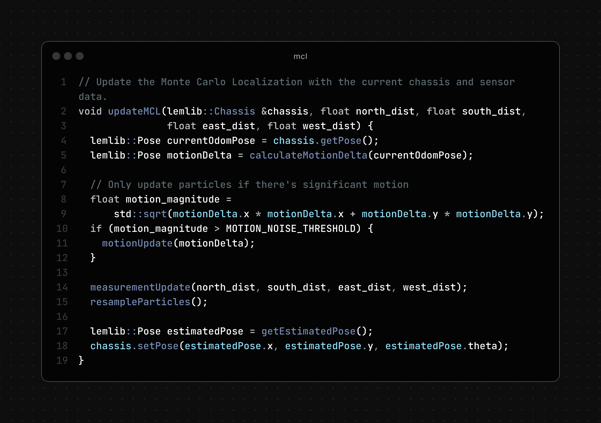

<h1 align="center">Monte Carlo Localization for VEX V5</h1>

    
    

This project implements an advanced motion control system for the VEX V5 platform, with a core focus on **Monte Carlo Localization (MCL)**, designed for the VEX High Stakes competition season. It utilizes PROS and LemLib.

## Core Feature: Monte Carlo Localization

This system's standout feature is its implementation of Monte Carlo Localization. MCL allows the robot to:

-   Estimate its position and orientation on the field with high accuracy, even with noisy sensor data.
-   Continuously update its pose by incorporating sensor readings (IMU, tracking wheels) and motion commands.
-   Improve autonomous routine reliability and enable more complex path planning.

The file `src/monte.cpp` likely contains the core logic for the Monte Carlo Localization algorithm.

## General Features

- Dual joystick tank drive with an exponential drive curve
- Autonomous mode selection via LVGL GUI
- Intake control system
- Pneumatic systems for mobile goal clamp and intake positioning
- Temperature monitoring for drivetrain and intake motors
- Reverse drive functionality
- Match timer with controller rumble alert
- And many more driver convenience features

## Hardware Configuration

- **Drivetrain:** 3 motors per side (66W)
- **Intake:** 1.5 motors (16.5W)
- **Lady Brown** 0.5 motors (5.5W)
- **Sensors:**
    - IMU
    - Horizontal tracking wheel
    - 4 Distance sensors
- **Pneumatics:**
    - Mobile goal clamp (large)

## Usage

1.  Flash the program to your VEX V5 brain.
2.  Run the program.
3.  Use the LVGL GUI on the brain screen to select an autonomous mode.
4.  **Driver Control:**
    - Left/Right Joysticks: Control drivetrain
    - R1/R2 Buttons: Control intake
    - L1 Button: Toggle mobile goal clamp
    - L2 Button: Toggle intake position
    - B Button: Toggle reverse drive

## Autonomous Modes

The following autonomous modes are available:

-   `auto.cpp`: Contains logic for regular autonomous routines.
    - Close Side (Default)
    - Far Side
-   `skills.cpp`: Contains logic for skills autonomous routines.
-   Off

## Code Snippet: Monte Carlo Localization Update Cycle

This shows the core Monte Carlo Localization (MCL) update cycle implemented in this project:

  

This function demonstrates the essential steps of MCL:

1. **Motion Update (Prediction):** Predicts the robot's new pose based on odometry (robot movement).
2. **Measurement Update (Correction):** Adjusts the particle weights using distance sensor measurements.
3. **Resampling:** Resamples the particle set based on their weights to focus on the most likely poses.
4. **Pose Estimation:** Computes the robot's estimated position and updates the chassis accordingly.

This cycle enables robust and accurate localization on the VEX V5 platform, even in the presence of sensor noise and uncertainty.

## Key Files and Directories

-   `src/main.cpp`: Main entry point of the program, contains driver control logic and GUI interaction.
-   `src/auto.cpp`: Implements the autonomous routines for matches.
-   `src/skills.cpp`: Implements the autonomous routines for skills challenges.
-   `src/monte.cpp`: Likely contains additional robot control logic or helper functions (based on file name).
-   `src/globals.cpp`: Defines global variables used across the project.
-   `include/main.h`: Header file for `main.cpp`.
-   `include/globals.h`: Header file for `globals.cpp`.
-   `include/robot/`: Likely contains robot-specific configurations or classes.
-   `liblvgl/`: Contains the LVGL library for the graphical user interface.
-   `lemlib/`: Contains the LemLib library for drivetrain control and odometry.
-   `project.pros`: PROS project configuration file.
-   `Makefile`: Used for building the project.

## Libraries Used

-   [PROS](https://pros.cs.purdue.edu/v5/pros-4/): A C/C++ SDK for the VEX V5 platform.
-   [LemLib](https://lemlib.readthedocs.io/): A library for advanced drivetrain control and odometry.
-   [LVGL](https://docs.lvgl.io/master/): A lightweight graphics library for embedded systems.

## Building the Project

1.  Ensure you have the PROS CLI installed.
2.  Navigate to the project's root directory in your terminal.
3.  Run the command `pros m`.

## Flashing to V5 Brain

1.  Connect your VEX V5 Brain to your computer.
2.  Run the command `pros u`.

## License

This project is currently unlicensed.
